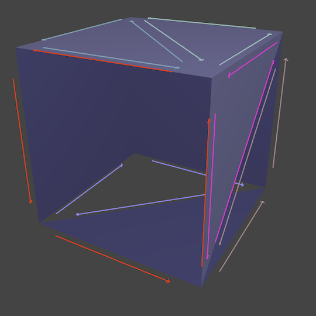
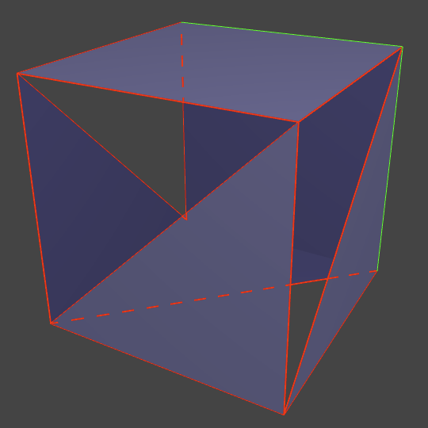

# three-mesh-halfedge

[](https://www.npmjs.com/package/three-mesh-halfedge)
[](https://github.com/LokiResearch/three-mesh-halfedge/actions)
[](https://LokiResearch.github.io/three-mesh-halfedge/doc/index.html)
[](#license)

A typescript implementation of the Halfedge structure for three.js geometries.



Supports multiple topologies:
- Multiple edges between the same vertices
- Isolated polygons
- Isolated edges
- Isolated vertices
- Mixed wireframe and polygons
- Polygons with an arbitrary number of vertices and edges
- Polygons meeting only at one vertex

## Examples

- [HalfedgeDS Visualisation](https://LokiResearch.github.io/three-mesh-halfedge/build-examples/HalfedgeDSVisualisation.html)
- [Realtime contours extraction](https://LokiResearch.github.io/three-mesh-halfedge/build-examples/ExtractContours.html)

## Installation
```bash
npm install three-mesh-halfedge
```

## Documentation

[](https://LokiResearch.github.io/three-mesh-halfedge/doc/index.html)

*Documentation is in progress.*

## Code snippets

##### Example 1: Build the Halfedge structure
```ts
import * as THREE from 'three';
import { HalfedgeDS } from 'three-mesh-halfedge';

// Build the Halfedge structure from a BoxGeometry
const geometry = new THREE.BoxGeometry();
const struct = new HalfedgeDS();
struct.setFromGeometry(geometry, 1e-10);
```

##### Example 2: Extract the boundary halfedges of a mesh
```ts
const struct = new HalfedgeDS();
struct.setFromGeometry(mesh.geometry);

// Get the boundary edges (keep only one halfedge for each pair)
const boundaries = new Set<Halfedge>();
for (const halfedge of struct.halfedges) {
	if (!boundaries.has(halfedge.twin) && !halfedge.face) {
		boundaries.add(halfedge);
	}
}
console.log("Boundary halfedges", boundaries);
```


##### Example 3: Get the front faces of a mesh
```ts
const struct = new HalfedgeDS();
struct.setFromGeometry(mesh.geometry);

// Get the camera position in mesh's space
const localCameraPos = mesh.worldToLocal(camera.position.clone());

//  Get the front faces
const array = [];
for (const face of struct.faces) {
	// /!\ Attention: position is considered in geometry local system
	if (face.isFront(localCameraPos)) { 
		array.push(face);
	}
}
console.log("Front faces", array);
```
## Useful links and references

[Kalle Rutanen Homepage - Halfedge data structures](https://kaba.hilvi.org/homepage/blog/halfedge/halfedge.htm)


